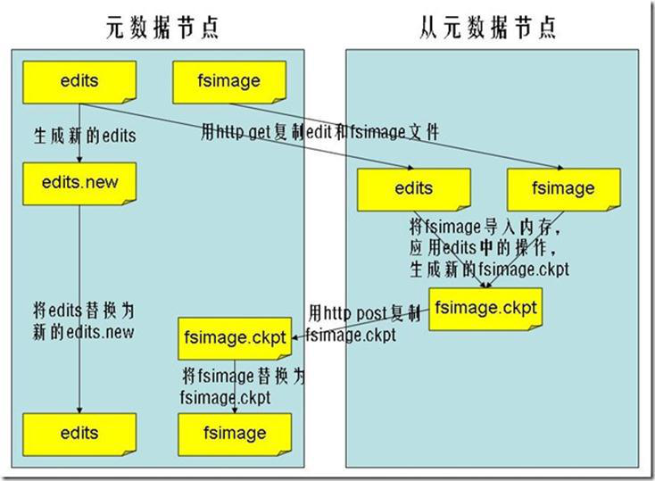

## 一 分布式文件系统介绍

在hadoop中，分布式文件系统对文件系统有一个抽象，HDFS只是其中一个实现类，即分布式文件系统定义了标准，HDFS是一个子实现类而已。  

在本地磁盘文件对分布式文件系统进行上传时，分布式文件系统除了记录计算机集群中各个节点存储的文件的描述信息，还包括：
- 小文件的存储：分布式文件系统会记录该文件的真实计算机存储位置
- 大文件的存储：大文件会被分割为多个小文件，并记录这些小文件的存储位置
  - 文件切块容易丢失，分布式文件系统还会引入副本备份机制，在多个节点上备份文件

## 二 HDFS架构的一些机制

### 2.1 NameNode与DataNode

  

NameNode：
- 负责客户端对文件的访问，包括读写
- 存储文件的元数据信息，这些信息保存在NameNode的两个地方：
  - 内存：读写性能高，但是不安全，宕机会造成数据丢失
  - 磁盘：元数据也会存储在磁盘中一份，这样可以防止宕机后内存数据消失隐患
- 控制文件副本存储在哪些DateNode上，读取文件时，尽量让用户先读取最近的副本，以降低读取网络开销和读取延时。
- 全权管理数据库复制，周期性的从集群中的每个DataNode接收心跳信号和状态报告，接收到心跳信号意味着DataNode节点工作正常，块状态报告包含了一个该DataNode上所有的数据列表。   

DateNode：存储文件的具体数据。

二者功能如图：     


### 2.2 文件副本机制与块存储

所有的文件都是以block块的方式存放在HDFS文件系统当中，在hadoop2当中，文件的block块大小默认是128M，block块的大小可以通过`hdfs-site.xml`当中的配置`dfs.block.size`进行指定（单位为字节）。  

抽象成数据块的好处：  
- 一个文件有可能大于集群中任意一个磁盘，分成多个block块后，这些block块属于一个文件
- 使用块抽象而不直接使用文件，可以有效简化存储子系统
- 块非常适合用于数据备份进而提供数据容错能力和可用性

**块缓存**：通常DataNode从磁盘中读取块，但对于访问频繁的文件，其对应的块可能被显式地缓存在DataNode的内存中，以堆外块缓存的形式存在。默认情况下，一个块仅缓存在一个DataNode的内存中，当然可以针对每个文件配置DataNode的数量。

### 2.3 hdfs的文件权限验证

hdfs的文件权限机制与linux系统的文件权限机制类似：
- r:read   
- w:write  
- x:execute  权限x对于文件表示忽略，对于文件夹表示是否有权限访问其内容

## 三 HDFS的文件操作

### 3.1 文件合并

当NameNode就一个的时候，所有的元数据信息都保存在FsImage与Eidts文件当中，配置位于hdfs-site.xml当中：
- edits：记录一段时间内的元数据信息变化，提及较小，例如增删改了哪些文件
- fsimage:存放了NameNode中完元数据的完整镜像，一般称为检查点，内容很大

更新文件的元数据信息主要是更新edits文件：
- 客户端对hdfs进行写文件时会首先被记录在edits文件中，edits修改时元数据也会更新
- 每次hdfs更新时，先更新edits后，客户端才会看到最新信息
- 随着edits内容增大，SecondaryNameNode会合并fsimage和edits，清空edits。

使用命令 ` hdfs  oev ` 可以查看edits当中的文件信息：
```
cd  /usr/local/hadoop-2.6.0-cdh5.14.0/hadoopDatas/dfs/nn/edits
hdfs oev -i  edits_0000000000000000865-0000000000000000866 -o myedit.xml -p XML
```

使用命令 `hdfs oiv ` 可以查看 FSimage文件当中的文件信息：
```
cd  /usr/local/hadoop-2.6.0-cdh5.14.0/hadoopDatas/namenodeDatas/current
hdfs oiv -i fsimage_0000000000000000864 -p XML -o hello.xml
```

SecondaryNameNode管理FSImage与Edits文件的流程：
- 1 SecondaryNameNod通知NameNode切换editlog。（收到通知后，NameNode会暂时将新写入操作存入一个新的文件edtis.new中）
- 2 SecondaryNameNod从NameNode中获得FSImage和editlog。（通过http get 方式）
- 3 SecondaryNameNod将FSImage载入内存，然后开始合并editlog，成为新的fsimage
- 4 SecondaryNameNod将新的FSImage发回给NameNode。（通过http post方式）
- 5 NameNode用接受到的新FSImage替换旧的FSImage，并把edits.new变为edits，更新fstime

如图所示：  

  

注意点：
- hadoop进入安全模式时需要管理员使用dfsadmin的save namespace来创建新的检查点。  
- secondarynamenode在合并edits和fsimage时需要消耗的内存和namenode差不多，所以一般把namenode和secondarynamenode放在不同的机器上。  
- fs.checkpoint.period: 默认是一个小时（3600s)
- fs.checkpoint.size:  edits达到一定大小时也会触发合并（默认64MB)
- edits与fsimage合并时机策略收到  `时间长短  +  文件大小` 限制，比如可以定义两个小时，或者edits文件大小达到1GB的时候合并一次。  

### 3.2 文件写入

  

详细步骤解析：
- 1 客户端通过RPC与NameNode建立通讯，发起文件上传到分布式系统的请求
- 2 NameNode接收到请求后，校验：检查目标文件是否已存在，父目录是否存在，返回是否可以上传
- 3 可以上传，则客户端请求NameNode上传第一个block
- 4 NameNode根据配置文件制定的备份数量、机架感知原理进行文件分配，返回可用的DataNode的地址如：A，B，C（默认存储三份：本地、同机架内其他某一节点上的一份，不同机架的某一节点上的一份）
- 5 客户端请求3台DataNode中的一台A上传数据（本质上是一个RPC调用，建立pipeline），A收到请求会继续调用B，然后B调用C，将整个pipeline建立完成，之后逐级返回client；
- 6 客户端开始往A上传第一个block（先从磁盘读取数据放到一个本地内存缓存），以packet为单位（默认64K），A收到一个packet就会传给B，B传给C；A每传一个packet会放入一个应答队列等待应答。
- 7 数据被分割成一个个packet数据包在pipeline上依次传输，在pipeline反方向上，逐个发送ack（命令正确应答），最终由pipeline中第一个DataNode节点A将pipelineack发送给客户端;
- 8 当一个block传输完成之后，客户端再次请求NameNode上传第二个block到服务器。

### 3.3 文件读取

  

详细步骤解析
- 1 Client向NameNode发起RPC请求，来确定请求文件block所在的位置； 
- 2 NameNode会视情况返回文件的部分或者全部block列表，对于每个block，NameNode 都会返回含有该 block 副本的 DataNode 地址；这些返回的 DN 地址，会按照集群拓扑结构得出 DataNode 与客户端的距离，然后进行排序，排序两个规则：网络拓扑结构中距离 Client 近的排靠前；心跳机制中超时汇报的 DN 状态为 STALE，这样的排靠后； 
- 3 Client 选取排序靠前的 DataNode 来读取 block，如果客户端本身就是DataNode,那么将从本地直接获取数据(短路读取特性)； 
- 4 底层上本质是建立 Socket Stream（FSDataInputStream），重复的调用父类 DataInputStream 的 read 方法，直到这个块上的数据读取完毕； 
- 5 当读完列表的 block 后，若文件读取还没有结束，客户端会继续向NameNode 获取下一批的 block 列表； 
- 6 读取完一个 block 都会进行 checksum 验证，如果读取 DataNode 时出现错误，客户端会通知 NameNode，然后再从下一个拥有该 block 副本的DataNode 继续读。 
- 7 read 方法是并行的读取 block 信息，不是一块一块的读取；NameNode 只是返回Client请求包含块的DataNode地址，并不是返回请求块的数据；
- 8 最终读取来所有的 block 会合并成一个完整的最终文件。