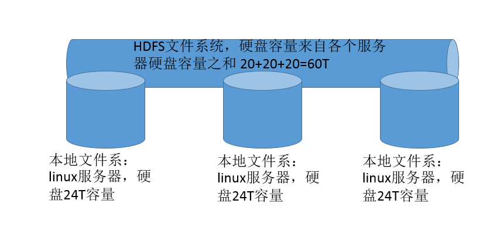

## 一 HDFS介绍

简单理解hdfs：每台机器出一块磁盘，凑成一个大的硬盘，大的硬盘的容量来自各个服务器的硬盘容量之和。  

HDFS 是 Hadoop Distribute File System 的简称，即 Hadoop 分布式文件系统。  

HDFS 是 Hadoop 核心组件之一，作为最底层的分布式存储服务而存在。 

分布式文件系统解决的问题就是大数据存储。它们是横跨在多台计算机上的存储系统。  

hdfs文件系统思想图示：
  

hdfs的特点：
- 首先，它是一个文件系统，用于存储文件，通过统一的命名空间目录树来定位文件； 
- 其次，它是分布式的，由很多服务器联合起来实现其功能，集群中的服务器有各自的角色。

## 二 HDFS架构

#### 2.1 master/slave 架构 

HDFS 采用 master/slave 架构。一般一个 HDFS 集群是有一个 Namenode 和一定数目的Datanode 组成。  

Namenode 是 HDFS 集群主节点，Datanode 是 HDFS 集群从节点，两种角色各司其职，共同协调完成分布式的文件存储服务。

#### 2.2 分块存储 

HDFS 中的文件在物理上是分块存储（block）的，块的大小可以通过配置参数来规定，默认大小在 hadoop2.x 版本中是 128M。 

### 2.3 名字空间 NameSpace

HDFS 支持传统的层次型文件组织结构。用户或者应用程序可以创建目录，然后将文件保存在这些目录里。文件系统名字空间的层次结构和大多数现有的文件系统类似：用户可以创建、删除、移动或重命名文件。  

Namenode 负责维护文件系统的名字空间，任何对文件系统名字空间或属性的修改都将被Namenode 记录下来。   

HDFS 会给客户端提供一个统一的抽象目录树，客户端通过路径来访问文件，形如：hdfs://namenode:port/dir-a/dir-b/dir-c/file.data。 

#### 2.4  元数据管理 Namenode  

我们把目录结构及文件分块位置信息叫做元数据。Namenode 负责维护整个hdfs文件系统的目录树结构，以及每一个文件所对应的 block 块信息（block 的id，及所在的datanode 服务器）。  

#### 2.5 数据存储  Datanode 

文件的各个 block 的具体存储管理由 datanode 节点承担。每一个 block 都可以在多个datanode 上。Datanode 需要定时向 Namenode 汇报自己持有的 block信息。 存储多个副本（副本数量也可以通过参数设置 dfs.replication，默认是 3）。 

#### 2.6 副本机制 

为了容错，文件的所有 block 都会有副本。每个文件的 block 大小和副本系数都是可配置的。应用程序可以指定某个文件的副本数目。副本系数可以在文件创建的时候指定，也可以在之后改变。 

#### 2.7 一次写入，多次读出 

HDFS 是设计成适应一次写入，多次读出的场景，且不支持文件的修改。 
正因为如此，HDFS 适合用来做大数据分析的底层存储服务，并不适合用来做.网盘等应用，因为，修改不方便，延迟大，网络开销大，成本太高。

