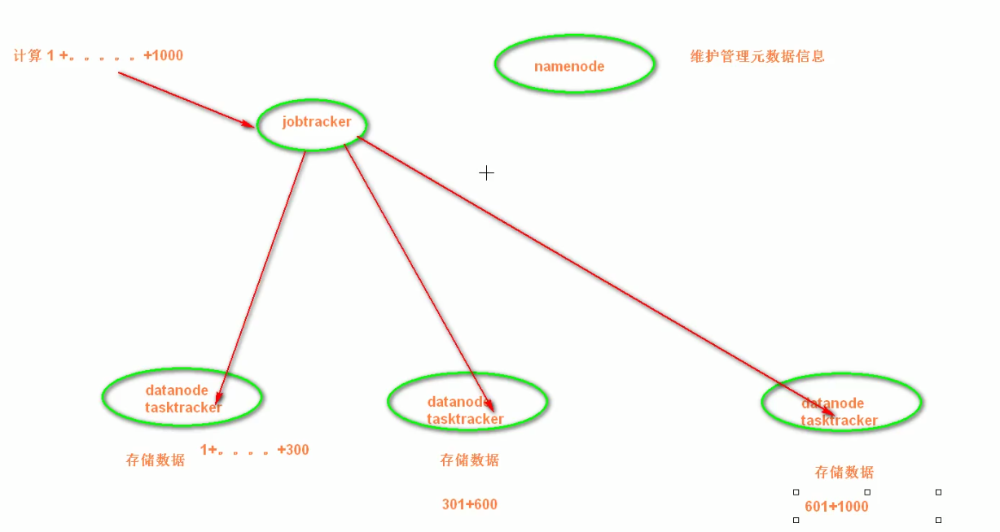
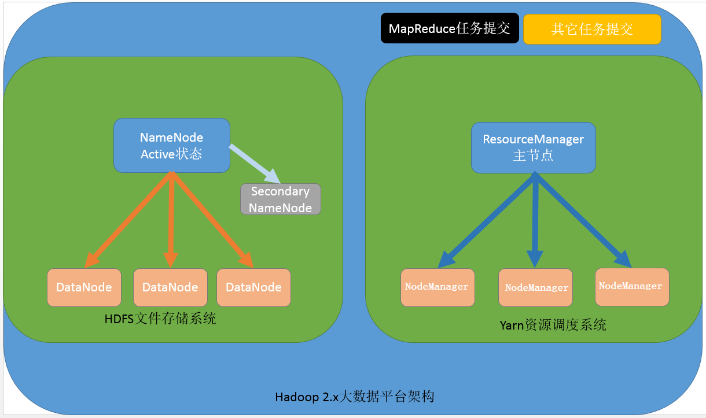
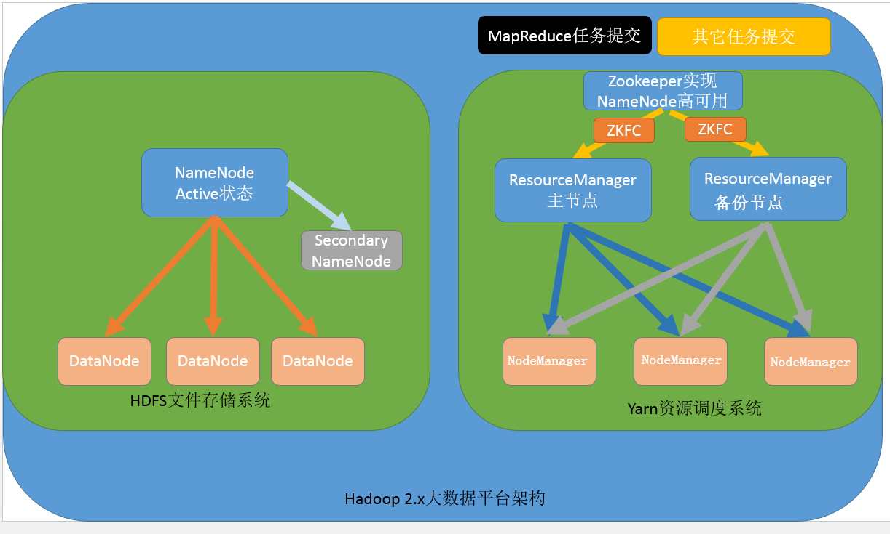
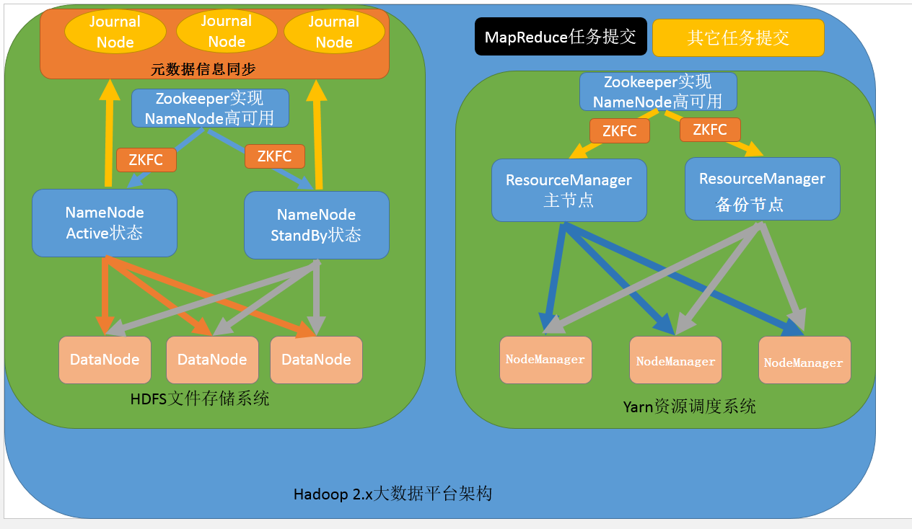

## 一 hadoop1.x架构模型  

  

1.x架构分为两大模块：
- 文件系统核心模块：
  - NameNode：集群当中的主节点，主要用于管理集群当中的各种数据
  - secondaryNameNode：主要能用于hadoop当中元数据信息的辅助管理
  - DataNode：集群当中的从节点，主要用于存储集群当中的各种数据
- 数据计算核心模块：
  - JobTracker：接收用户的计算请求任务，并分配任务给从节点
  - TaskTracker：负责执行主节点JobTracker分配的任务

## 二 hadoop2.x架构模型  

#### 2.1 NameNode与ResourceManager单节点架构模型

  

- 文件系统核心模块：
  - NameNode：集群当中的主节点，主要用于管理集群当中的各种数据
  - secondaryNameNode：主要能用于hadoop当中元数据信息的辅助管理
  - DataNode：集群当中的从节点，主要用于存储集群当中的各种数据
- 数据计算核心模块：
  - ResourceManager：接收用户的计算请求任务，并负责集群的资源分配
  - NodeManager：负责执行主节点APPmaster分配的任务

#### 2.2 NameNode单节点与ResourceManager高可用架构模型

 

- 文件系统核心模块：
  - NameNode：集群当中的主节点，主要用于管理集群当中的各种数据
  - secondaryNameNode：主要能用于hadoop当中元数据信息的辅助管理
  - DataNode：集群当中的从节点，主要用于存储集群当中的各种数据
- 数据计算核心模块：
  - ResourceManager：接收用户的计算请求任务，并负责集群的资源分配，以及计算任务的划分，通过zookeeper实现ResourceManager的高可用
  - NodeManager：负责执行主节点ResourceManager分配的任务

#### 2.3 NameNode高可用与ResourceManager单节点架构模型

   

- 文件系统核心模块：
  - NameNode：集群当中的主节点，主要用于管理集群当中的各种数据，其中 nameNode可以有两个，形成高可用状态
  - DataNode：集群当中的从节点，主要用于存储集群当中的各种数据
  - JournalNode：文件系统元数据信息管理
- 数据计算核心模块：
  - ResourceManager：接收用户的计算请求任务，并负责集群的资源分配，以及计算任务的划分
  - NodeManager：负责执行主节点ResourceManager分配的任务

#### 2.4 

 

- 文件系统核心模块：
  - NameNode：集群当中的主节点，主要用于管理集群当中的各种数据，一般都是使用两个，实现HA高可用
  - JournalNode：元数据信息管理进程，一般都是奇数个
  - DataNode：从节点，用于数据的存储
- 数据计算核心模块：
  - ResourceManager：Yarn平台的主节点，主要用于接收各种任务，通过两个，构建成高可用
  - NodeManager：Yarn平台的从节点，主要用于处理ResourceManager分配的任务