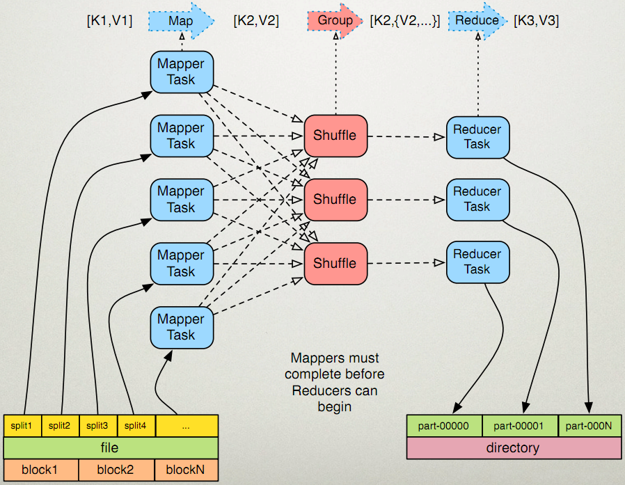
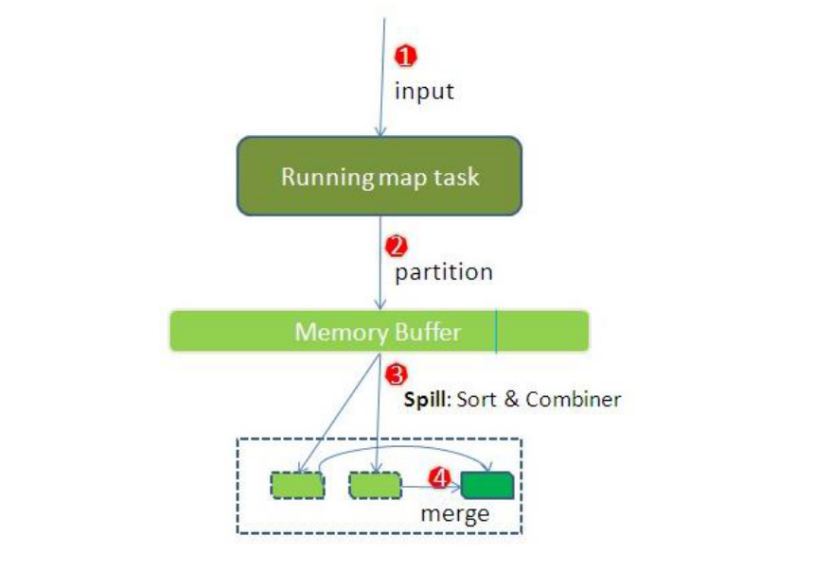
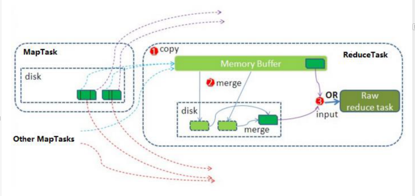

## 一 MapTask运行机制详解以及Map任务的并行度

#### 1.1 MapReduce运行流程图

  

  

整个Map阶段流程大体如上图所示：inputFile通过split被逻辑切分为多个split文件，通过Record按行读取内容给map（用户自己实现的）进行处理，数据被map处理结束之后交给OutputCollector收集器，对其结果key进行分区（默认使用hash分区），然后写入buffer，每个map task都有一个内存缓冲区，存储着map的输出结果，当缓冲区快满的时候需要将缓冲区的数据以一个临时文件的方式存放到磁盘，当整个map task结束后再对磁盘中这个map task产生的所有临时文件做合并，生成最终的正式输出文件，然后等待reduce task来拉数据。  


#### 1.2 详细步骤

第一步：读取数据组件InputFormat（默认TextInputFormat）会通过getSplits方法对输入目录中文件进行逻辑切片规划得到splits，有多少个split就对应启动多少个MapTask。split与block的对应关系默认是一对一。   

第二步：将输入文件切分为splits之后，由RecordReader对象（默认LineRecordReader）进行读取，以\n作为分隔符，读取一行数据，返回`<key，value>`。Key表示每行首字符偏移值，value表示这一行文本内容  


第三步：读取split返回`<key,value>`，进入用户自己继承的Mapper类中，执行用户重写的map函数。RecordReader读取一行这里调用一次。  


第四步：map逻辑完之后，将map的每条结果通过context.write进行collect数据收集。在collect中，会先对其进行分区处理，默认使用HashPartitioner。  

MapReduce提供Partitioner接口，它的作用就是根据key或value及reduce的数量来决定当前的这对输出数据最终应该交由哪个reduce task处理。默认对key hash后再以reduce task数量取模。默认的取模方式只是为了平均reduce的处理能力，如果用户自己对Partitioner有需求，可以订制并设置到job上。  

第五步：将数据写入内存，内存中这片区域叫做环形缓冲区，缓冲区的作用是批量收集map结果，减少磁盘IO的影响。我们的key/value对以及Partition的结果都会被写入缓冲区。当然写入之前，key与value值都会被序列化成字节数组。  

环形缓冲区其实是一个数组，数组中存放着key、value的序列化数据和key、value的元数据信息，包括partition、key的起始位置、value的起始位置以及value的长度。环形结构是一个抽象概念。  

缓冲区是有大小限制，默认是100MB。当map task的输出结果很多时，就可能会撑爆内存，所以需要在一定条件下将缓冲区中的数据临时写入磁盘，然后重新利用这块缓冲区。这个从内存往磁盘写数据的过程被称为Spill，中文可译为溢写。这个溢写是由单独线程来完成，不影响往缓冲区写map结果的线程。溢写线程启动时不应该阻止map的结果输出，所以整个缓冲区有个溢写的比例spill.percent。这个比例默认是0.8，也就是当缓冲区的数据已经达到阈值（buffer size * spill percent = 100MB * 0.8 = 80MB），溢写线程启动，锁定这80MB的内存，执行溢写过程。Map task的输出结果还可以往剩下的20MB内存中写，互不影响。   

第六步：当溢写线程启动后，需要对这80MB空间内的key做排序(Sort)。排序是MapReduce模型默认的行为，这里的排序也是对序列化的字节做的排序。  
那哪些场景才能使用Combiner呢？从这里分析，Combiner的输出是Reducer的输入，Combiner绝不能改变最终的计算结果。Combiner只应该用于那种Reduce的输入key/value与输出key/value类型完全一致，且不影响最终结果的场景。比如累加，最大值等。Combiner的使用一定得慎重，如果用好，它对job执行效率有帮助，反之会影响reduce的最终结果。  

第七步：合并溢写文件：每次溢写会在磁盘上生成一个临时文件（写之前判断是否有combiner），如果map的输出结果真的很大，有多次这样的溢写发生，磁盘上相应的就会有多个临时文件存在。当整个数据处理结束之后开始对磁盘中的临时文件进行merge合并，因为最终的文件只有一个，写入磁盘，并且为这个文件提供了一个索引文件，以记录每个reduce对应数据的偏移量。  

### 1.3 一些配置

mapTask的一些基础设置配置（mapred-site.xml）：
```
# 设置环型缓冲区的内存值大小（默认设置如下）
mapreduce.task.io.sort.mb               100

# 设置溢写百分比（默认设置如下）
mapreduce.map.sort.spill.percent        0.80

# 设置溢写数据目录（默认设置）
mapreduce.cluster.local.dir             ${hadoop.tmp.dir}/mapred/local

# 设置一次最多合并多少个溢写文件（默认设置如下）
mapreduce.task.io.sort.factor           10
```

## 二 ReduceTask 工作机制以及reduceTask的并行度

  

Reduce大致分为copy、sort、reduce三个阶段，重点在前两个阶段。copy阶段包含一个eventFetcher来获取已完成的map列表，由Fetcher线程去copy数据，在此过程中会启动两个merge线程，分别为inMemoryMerger和onDiskMerger，分别将内存中的数据merge到磁盘和将磁盘中的数据进行merge。待数据copy完成之后，copy阶段就完成了，开始进行sort阶段，sort阶段主要是执行finalMerge操作，纯粹的sort阶段，完成之后就是reduce阶段，调用用户定义的reduce函数进行处理。  

详细步骤：
- 1 Copy阶段，简单地拉取数据。Reduce进程启动一些数据copy线程(Fetcher)，通过HTTP方式请求maptask获取属于自己的文件。  
- 2 Merge阶段。这里的merge如map端的merge动作，只是数组中存放的是不同map端copy来的数值。Copy过来的数据会先放入内存缓冲区中，这里的缓冲区大小要比map端的更为灵活。merge有三种形式：内存到内存；内存到磁盘；磁盘到磁盘。默认情况下第一种形式不启用。当内存中的数据量到达一定阈值，就启动内存到磁盘的merge。与map 端类似，这也是溢写的过程，这个过程中如果你设置有Combiner，也是会启用的，然后在磁盘中生成了众多的溢写文件。第二种merge方式一直在运行，直到没有map端的数据时才结束，然后启动第三种磁盘到磁盘的merge方式生成最终的文件。
- 3 合并排序。把分散的数据合并成一个大的数据后，还会再对合并后的数据排序。
- 4 对排序后的键值对调用reduce方法，键相等的键值对调用一次reduce方法，每次调用会产生零个或者多个键值对，最后把这些输出的键值对写入到HDFS文件中。