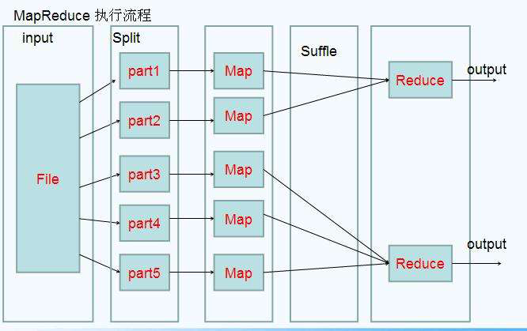
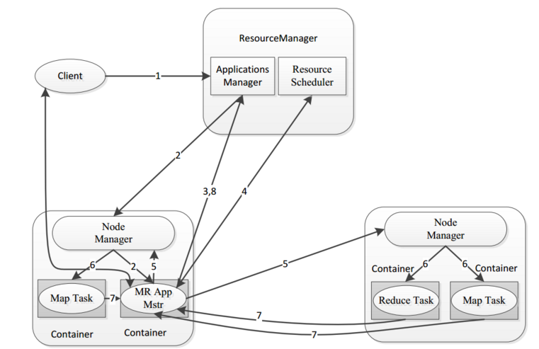

## 一 简单理解MapReduce

MapReduce是一种 分治 思想，适用于大规模数据处理场景：
- Map：负责“分”，即把复杂的任务分解为若干个“简单的任务”来并行处理。可以进行拆分的前提是这些小任务可以并行计算，彼此间几乎没有依赖关系。 
- Reduce：负责“合”，即对map阶段的结果进行全局汇总 

MapReduce思想模型:  
  

形象的来说：我们要数图书馆中的所有书
- Map：A数1号书架，B数2号书架，C数3号书架，人越多，数书的速度就越快
- Reduce：最终把所有人的统计数加在一起  

MapReduce是一个分布式运算编程框架，核心功能是将用户编写的业务逻辑代码和自带组件整合成一个完整的分布式运算程序，并发运行在Hadoop集群上。MapReduce操作一个输入（input），通过本身定义好的计算模型，得到一个输出（output）。   

## 二 MapReduce设计思路

#### 2.1  分而治之

对相互间不具有计算依赖关系的大数据，实现并行最自然的办法就是采取分而治之的策略。并行计算的第一个重要问题是如何划分计算任务或者计算数据以便对划分的子任务或数据块同时进行计算。不可分拆的计算任务或相互间有依赖关系的数据无法进行并行计算！  

#### 2.2 抽象模型Map和Reduce

MapReduce借鉴了函数式语言中的思想，用Map和Reduce两个函数提供了高层的并行编程抽象模型：
- Map(映射): 对一组数据元素进行某种重复式的处理，可以高度并行处理，对应代码中的抽象接口为map: `(k1; v1) → [(k2; v2)]`
- Reduce（化简）: 对Map的中间结果进行某种进一步的结果整理，即对一个列表的元素进行合并，对应代码中的抽象接口为：reduce：`(k2; [v2]) → [(k3; v3)]`

通过以上两个编程接口，可以看出MapReduce处理的数据类型是`<key,value>`键值对。一个简单的MapReduce程序只需要制定`map(),reduce(),input,output`即可，剩下的事情交给框架处理。  

#### 2.3 统一构架，隐藏系统层细节

Hadoop隐藏了大量的底层细节，开发者不再需要考虑诸如数据存储、划分、分发、结果收集、错误恢复等诸多细节；MapReduce为此设计并提供了统一接口。  

## 三 MapReduce框架结构

一个完整的mapreduce程序在分布式运行时有三类实例进程：
- MRAppMaster：负责整个程序的过程调度及状态协调
- MapTask：负责map阶段的整个数据处理流程
- ReduceTask：负责reduce阶段的整个数据处理流程

  

## 四 MapReduce编程规范

- 第一阶段：Map阶段
  - 1 设置inputFormat类，将我们的数据切分成key，value对，输入到第二步
  - 2 自定义map逻辑，处理我们第一步的输入数据，然后转换成新的key，value对进行输出
- 第二阶段：shuffle
  - 1：对输出的key，value对进行分区
  - 2：对不同分区的数据按照相同的key进行排序
  - 3：对分组后的数据进行规约(combine操作)，降低数据的网络拷贝（可选步骤）
  - 4：对排序后的额数据进行分组，分组的过程中，将相同key的value放到一个集合当中
- 第三阶段：reduce
  - 1：对多个map的任务进行合并，排序，写reduce函数自己的逻辑，对输入的key，value对进行处理，转换成新的key，value对进行输出
  - 2：设置outputformat将输出的key，value对数据进行保存到文件中