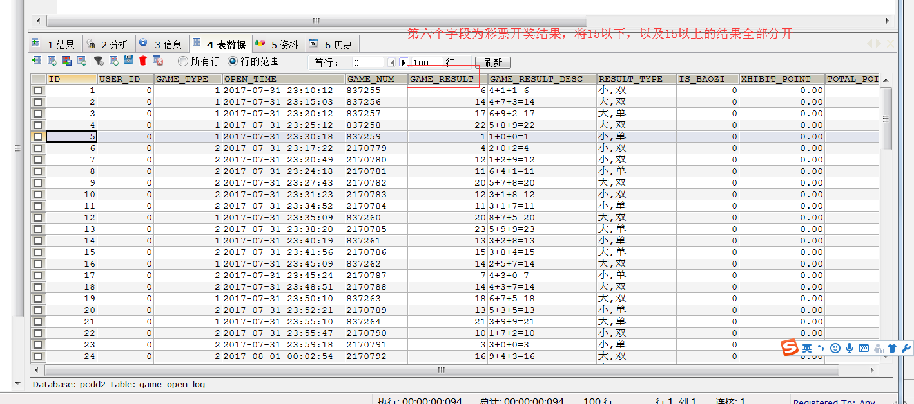

## 一 MapReduce分区与reduceTask数量

#### 1.0 理解分区

在MapReduce中，通过指定分区将同一个分区的数据发送到同一个reduce当中进行处理，例如为了数据的统计，可以把一批类似的数据发送到同一个reduce当中去，在同一个reduce当中统计相同类型的数据，就可以实现类似数据的分区，统计等。简单理解就是相同类型的数据，送到一起去处理，在reduce当中默认分区只有1个。  

分区类Partitioner：
- TotalOrderPartitioner
- KeyFieldBasePartitioner
- HashPartitioner
- BinaryPartitioner


#### 1.1 分区示例

将下图中的数据，第五个字段-开讲结果值按照15以上、15以下分为两个文件存储：  

  

贴士：分区的案例，只能打成jar包发布到集群上面去运行。  

第一步：定义mapper，这里的mapper程序不做任何逻辑，也不对key，与value做任何改变，只是接收我们的数据，然后往下发送。
```java
public class MyMapper extends Mapper<LongWritable,Text,Text,NullWritable>{
    @Override
    protected void map(LongWritable key, Text value, Context context) throws IOException, InterruptedException {
        context.write(value,NullWritable.get());
    }
}
```

第二步：定义reducer逻辑，reducer也不做任何处理，将数据原封不动的输出即可
```java
public class MyReducer extends Reducer<Text,NullWritable,Text,NullWritable> {
    @Override
    protected void reduce(Text key, Iterable<NullWritable> values, Context context) throws IOException, InterruptedException {
        context.write(key,NullWritable.get());
    }
}
```

第三步：自定义partitioner，这里的输入类型与map阶段的输出类型相同
```java
public class MyPartitioner extends Partitioner<Text,NullWritable>{
    /**
     * 返回值表示我们的数据要去到哪个分区
     * 返回值只是一个分区的标记，标记所有相同的数据去到指定的分区
     */
    @Override
    public int getPartition(Text text, NullWritable nullWritable, int i) {
        String result = text.toString().split("\t")[5];
        System.out.println(result);
        if (Integer.parseInt(result) > 15){
            return 1;
        }else{
            return 0;
        }
    }
}
```

第四步：程序main函数入口
```java
public class PartitionMain  extends Configured implements Tool {
    public static void main(String[] args) throws  Exception{
        int run = ToolRunner.run(new Configuration(), new PartitionMain(), args);
        System.exit(run);
    }
    @Override
    public int run(String[] args) throws Exception {
        Job job = Job.getInstance(super.getConf(), PartitionMain.class.getSimpleName());
        job.setJarByClass(PartitionMain.class);
        job.setInputFormatClass(TextInputFormat.class);
        job.setOutputFormatClass(TextOutputFormat.class);
        TextInputFormat.addInputPath(job,new Path("hdfs://192.168.120.111:8020/partitioner"));
        TextOutputFormat.setOutputPath(job,new Path("hdfs://192.168.120.111:8020/outpartition"));
        job.setMapperClass(MyMapper.class);
        job.setMapOutputKeyClass(Text.class);
        job.setMapOutputValueClass(NullWritable.class);
        job.setOutputKeyClass(Text.class);
        job.setMapOutputValueClass(NullWritable.class);
        job.setReducerClass(MyReducer.class);
        /**
         * 设置我们的分区类，以及我们的reducetask的个数，注意reduceTask的个数一定要与我们的
         * 分区数保持一致
         */
        job.setPartitionerClass(MyPartitioner.class);
        job.setNumReduceTasks(2);
        boolean b = job.waitForCompletion(true);
        return b?0:1;
    }
}
```