## 一 入门示例：WordCount

### 1.1 需求与数据

需求：在一堆给定的文本文件中统计输出每一个单词出现的总次数。  

`vim wordcount.txt`数据格式：
```
hello,world,hadoop
hive,hello
hadoop
```

上传入hdfs：
```
hdfs dfs -mkdir /wordcount/
hdfs dfs -put wordcount.txt /wordcount/
```

### 1.2 运行原理图



### 1.3 代码示例

定义一个mapper类：
```java
package com.demo;

import org.apache.hadoop.io.LongWritable;
import org.apache.hadoop.io.Text;
import org.apache.hadoop.mapreduce.Mapper;

import java.io.IOException;

public class WordCountMapper extends Mapper<LongWritable, Text, Text, LongWritable> {
    @Override
    public void map(LongWritable key, Text value, Context context) throws IOException, InterruptedException {
        String line = value.toString();
        String[] split = line.split(",");
        for (String word : split) {
            context.write(new Text(word),new LongWritable(1));
        }
    }
}

```

定义一个reducer类：
```java
package com.demo;

import org.apache.hadoop.io.LongWritable;
import org.apache.hadoop.io.Text;
import org.apache.hadoop.mapreduce.Reducer;

import java.io.IOException;

public class WordCountReducer extends Reducer<Text, LongWritable,Text,LongWritable> {
    @Override
    protected void reduce(Text key, Iterable<LongWritable> values, Context context) throws IOException, InterruptedException {
        long count = 0;
        for (LongWritable value : values) {
            count += value.get();
        }
        context.write(key,new LongWritable(count));
    }
}

```

定义一个主类：
```java
package com.demo;
import org.apache.hadoop.conf.Configuration;
import org.apache.hadoop.conf.Configured;
import org.apache.hadoop.fs.Path;
import org.apache.hadoop.io.LongWritable;
import org.apache.hadoop.io.Text;
import org.apache.hadoop.mapreduce.Job;
import org.apache.hadoop.mapreduce.lib.input.TextInputFormat;
import org.apache.hadoop.mapreduce.lib.output.TextOutputFormat;
import org.apache.hadoop.util.Tool;
import org.apache.hadoop.util.ToolRunner;

public class Demo extends Configured implements Tool {

    @Override
    public int run(String[] args) throws Exception {

        //打包到集群上面运行时候，必须要添加以下配置，指定程序的main函数
        Job job = Job.getInstance(super.getConf(), Demo.class.getSimpleName());
        job.setJarByClass(Demo.class);     // 如果需要打包运行，需要加入该句            

        //第一步：读取输入文件解析成key，value对
        job.setInputFormatClass(TextInputFormat.class);
        TextInputFormat.addInputPath(job,new Path("hdfs://192.168.186.131:8020/wordcount"));

        //第二步：设置我们的mapper类
        job.setMapperClass(WordCountMapper.class);
        //设置map阶段完成之后的输出类型
        job.setMapOutputKeyClass(Text.class);
        job.setMapOutputValueClass(LongWritable.class);

        //第三、四、五、六步省略

        //第七步：设置reduce类
        job.setReducerClass(WordCountReducer.class);
        //设置reduce阶段完成之后的输出类型
        job.setOutputKeyClass(Text.class);
        job.setOutputValueClass(LongWritable.class);

        //第八步：设置输出类以及输出路径
        job.setOutputFormatClass(TextOutputFormat.class);
        TextOutputFormat.setOutputPath(job,new Path("hdfs://192.168.186.131:8020/wordcount_out2"));
        boolean b = job.waitForCompletion(true);
        return b?0:1;
    }

    public static void main(String[] args) throws Exception {
        // runCode是运行结果的状态码值
        int runCode = ToolRunner.run(new Configuration(), new Demo(), args);
        System.out.println(runCode);
        System.exit(runCode);
    }
}
```

贴士：为了调试方便，可以将上述路径设置为本地路径，可以本地直接运行。 

贴士：如果出现错误 `org.apache.hadoop.ipc.RemoteException(org.apache.hadoop.security.AccessControlException): Permission denied: user=admin, access=WRITE, inode="/":root:supergroup:drwxr-xr-x `，直接将hdfs-site.xml当中的权限按照如下所示关闭，再重启hdfs集群即可：
```xml
<property>
    <name>dfs.permissions</name>
    <value>false</value>
</property>
```
当然在生产环境中这种做法是相当粗撸的，应该使用jar包方式，首先添pom.xml加插件：
```
            <plugin>
                <groupId>org.apache.maven.plugins</groupId>
                <artifactId>maven-shade-plugin</artifactId>
                <version>2.4.3</version>
                <executions>
                    <execution>
                        <phase>package</phase>
                        <goals>
                            <goal>shade</goal>
                        </goals>
                        <configuration>
                            <minimizeJar>true</minimizeJar>
                        </configuration>
                    </execution>
                </executions>
            </plugin>
```
然后打开IDEA中的MavenProject（默认位于右侧边栏），选中目录：项目/Lifecycle/test，点击取消（闪电图标），然后清洁：双击clean，最后打包：双击package，陈恭候会在target根目录中生成了两个jar包，分别是项目名的jar包和带original前缀的jar包。将orignal的文件夹上传到hadoop服务器，运行：
```
hadoop 名称.jar com.demo.Demo
```

## 二 MapReduce程序运行模式

### 2.1 本地运行模式

- （1）mapreduce程序是被提交给LocalJobRunner在本地以单进程的形式运行
- （2）而处理的数据及输出结果可以在本地文件系统，也可以在hdfs上
- （3）怎样实现本地运行？写一个程序，不要带集群的配置文件
本质是程序的conf中是否有mapreduce.framework.name=local以及yarn.resourcemanager.hostname=local参数
- （4）本地模式非常便于进行业务逻辑的debug，只要在eclipse中打断点即可

本地模式运行代码设置：
```
configuration.set("mapreduce.framework.name","local");
configuration.set(" yarn.resourcemanager.hostname","local");
TextInputFormat.addInputPath(job,new Path("file:///E:\\testhadoop\\wordcount\\input"));
TextOutputFormat.setOutputPath(job,new Path("file:///E:\\testhadoop\\wordcount\\output"));
```

### 2.2 集群运行模式

- （1）将mapreduce程序提交给yarn集群，分发到很多的节点上并发执行
- （2）处理的数据和输出结果应该位于hdfs文件系统
- （3）提交集群的实现步骤：将程序打成JAR包，然后在集群的任意一个节点上用hadoop命令启动

```
yarn jar hadoop_hdfs_operate-1.0-SNAPSHOT.jar com.testhadoop.hdfs.demo1.JobMain
```