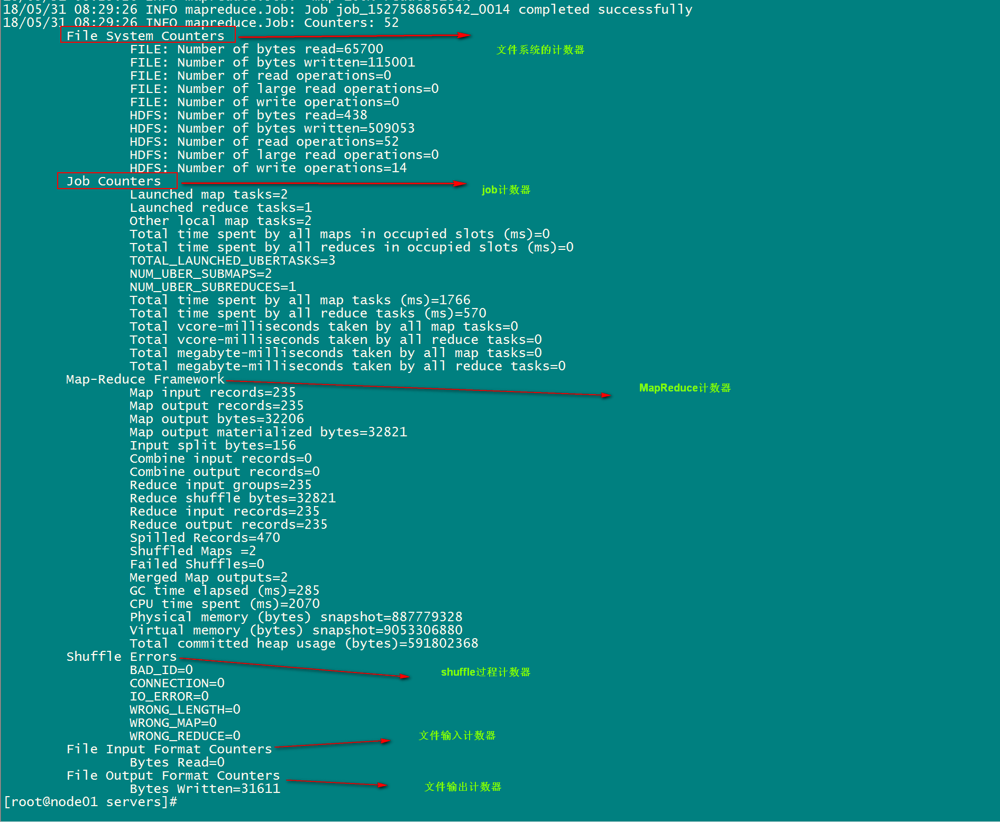

## 一 MapReduce中的计数器

计数器是收集作业统计信息的有效手段之一，用于质量控制或应用级统计。计数器还可辅助诊断系统故障。 如果需要将日志信息传输到map 或reduce 任务，更好的方法通常是看能否用一个计数器值来记录某一特定事件的发生。对于大型分布式作业而言，使用计数器更为方便。除了因为获取计数器值比输出日志更方便，还有根据计数器值统计特定事件的发生次数要比分析一堆日志文件容易得多。  


hadoop内置计数器列表:
```
MapReduce任务计数器	        org.apache.hadoop.mapreduce.TaskCounter
文件系统计数器	             org.apache.hadoop.mapreduce.FileSystemCounter
FileInputFormat计数器	    org.apache.hadoop.mapreduce.lib.input.FileInputFormatCounter
FileOutputFormat计数器	    org.apache.hadoop.mapreduce.lib.output.FileOutputFormatCounter
作业计数器	                org.apache.hadoop.mapreduce.JobCounter
```

每次mapreduce执行完成之后，重要的日志如图：

  

## 二 示例

需求：设计计数器，用来统计map接收到的数据记录条数  

方案一：通过context上下文对象可以获取我们的计数器，进行记录，通过context上下文对象，在map端使用计数器进行统计

```java
public class SortMapper extends Mapper<LongWritable,Text,PairWritable,IntWritable> {

    private PairWritable mapOutKey = new PairWritable();
    private IntWritable mapOutValue = new IntWritable();

    @Override
    public  void map(LongWritable key, Text value, Context context) throws IOException, InterruptedException {
//自定义我们的计数器，这里实现了统计map数据数据的条数
        Counter counter = context.getCounter("MR_COUNT", "MapRecordCounter");
        counter.increment(1L);

        String lineValue = value.toString();
        String[] strs = lineValue.split("\t");

        //设置组合key和value ==> <(key,value),value>
        mapOutKey.set(strs[0], Integer.valueOf(strs[1]));
        mapOutValue.set(Integer.valueOf(strs[1]));
        context.write(mapOutKey, mapOutValue);
    }
}
```

方式二：通过enum枚举类型来定义计数器，统计reduce端数据的输入的key有多少个，对应的value有多少个
```java
public class SortReducer extends Reducer<PairWritable,IntWritable,Text,IntWritable> {

    private Text outPutKey = new Text();
    public static enum Counter{
        REDUCE_INPUT_RECORDS, REDUCE_INPUT_VAL_NUMS,
    }
    @Override
    public void reduce(PairWritable key, Iterable<IntWritable> values, Context context) throws IOException, InterruptedException {
        context.getCounter(Counter.REDUCE_INPUT_RECORDS).increment(1L);
        //迭代输出
        for(IntWritable value : values) {
            context.getCounter(Counter.REDUCE_INPUT_VAL_NUMS).increment(1L);
            outPutKey.set(key.getFirst());
            context.write(outPutKey, value);
        }
    }
}
```
