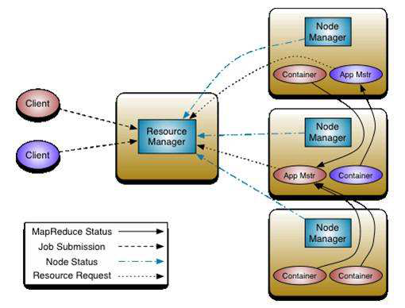

## 一 yarn介绍

yarn的管理界面：
- yarn集群的监控管理界面：http://192.168.52.100:8088/cluster
- jobHistoryServer查看界面：http://192.168.52.100:19888/jobhistory

yarn是hadoop集群当中的资源管理系统模块，从hadoop2.x开始引入yarn来进行管理集群当中的资源（主要是服务器的各种硬件资源，包括CPU，内存，磁盘，网络IO等）以及运行在yarn上面的各种任务。  

总结一句话就是说：yarn主要就是为了调度资源，管理任务等  

其调度分为两个层级来说：
- 一级调度管理：计算资源管理(CPU,内存，网络IO，磁盘)，App生命周期管理 （每一个应用执行的情况，都需要汇报给ResourceManager）
- 二级调度管理：任务内部的计算模型管理  (AppMaster的任务精细化管理)，多样化的计算模型 


## 二 yarn中的组件

yarn常用组件列表：
- ResourceManager：yarn集群的主节点，主要用于接收客户端提交的任务，并对资源进行分配
- NodeManager：yarn集群的从节点，主要用于任务的计算
- ApplicationMaster：当有新的任务提交到ResourceManager的时候，ResourceManager会在某个从节点nodeManager上面启动一个ApplicationMaster进程，负责这个任务执行的资源的分配，任务的生命周期的监控等
- Container：资源的分配单位，ApplicationMaster启动之后，与ResourceManager进行通信，向ResourceManager提出资源申请的请求，然后 ResourceManager将资源分配给ApplicationMaster，这些资源的表示，就是一个个的container
- JobHistoryServer：这是yarn提供的一个查看已经完成的任务的历史日志记录的服务，我们可以启动jobHistoryServer来观察已经完成的任务的所有详细日志信息
- TimeLineServer：hadoop2.4.0以后出现的新特性，主要是为了监控所有运行在yarn平台上面的所有任务（例如MR，Storm，Spark，HBase等等）

yarn中主要组件的作用：
- resourceManager主要作用：处理客户端请求，启动/监控ApplicationMaster，监控NodeManager，资源分配与调度
- NodeManager主要作用：单个节点上的资源管理和任务管理，接收并处理来自resourceManager的命令，接收并处理来自ApplicationMaster的命令，管理抽象容器container，定时向RM汇报本节点资源使用情况和各个container的运行状态
- ApplicationMaster主要作用：数据切分，为应用程序申请资源，任务监控与容错，负责协调来自ResourceManager的资源，开通NodeManager监视容的执行和资源使用（CPU,内存等的资源分配）
- Container主要作用：，对任务运行环境的抽象，任务运行资源（节点，内存，cpu），任务启动命令，任务运行环境

## 三 yarn架构

#### 3.0 架构图

  

使用哪种调度器取决于yarn-site.xml当中的yarn.resourcemanager.scheduler.class  这个属性的配置


#### 3.1 yarn中的调度器一 - FIFO Scheduler  （队列调度器）

把应用按提交的顺序排成一个队列，这是一个先进先出队列，在进行资源分配的时候，先给队列中最头上的应用进行分配资源，待最头上的应用需求满足后再给下一个分配，以此类推。  


FIFO Scheduler是最简单也是最容易理解的调度器，也不需要任何配置，但它并不适用于共享集群。大的应用可能会占用所有集群资源，这就导致其它应用被阻塞。在共享集群中，更适合采用Capacity Scheduler或Fair Scheduler，这两个调度器都允许大任务和小任务在提交的同时获得一定的系统资源。  

#### 3.2 yarn中的调度器二 - apacity  scheduler （容量调度器） 

CDH版本的hadoop默认使用的调度器。  

Capacity 调度器允许多个组织共享整个集群，每个组织可以获得集群的一部分计算能力。通过为每个组织分配专门的队列，然后再为每个队列分配一定的集群资源，这样整个集群就可以通过设置多个队列的方式给多个组织提供服务了。除此之外，队列内部又可以垂直划分，这样一个组织内部的多个成员就可以共享这个队列资源了，在一个队列内部，资源的调度是采用的是先进先出(FIFO)策略。

#### 3.3 yarn中的调度器二 - Fair Scheduler（公平调度器）

Fair调度器的设计目标是为所有的应用分配公平的资源（对公平的定义可以通过参数来设置）。公平调度在也可以在多个队列间工作。举个例子，假设有两个用户A和B，他们分别拥有一个队列。当A启动一个job而B没有任务时，A会获得全部集群资源；当B启动一个job后，A的job会继续运行，不过一会儿之后两个任务会各自获得一半的集群资源。如果此时B再启动第二个job并且其它job还在运行，则它将会和B的第一个job共享B这个队列的资源，也就是B的两个job会用于四分之一的集群资源，而A的job仍然用于集群一半的资源，结果就是资源最终在两个用户之间平等的共享  


## 四 yarn常用参数设置

第一个参数：container分配最小内存
 yarn.scheduler.minimum-allocation-mb  1024   给应用程序container分配的最小内存  

第二个参数：container分配最大内存
 yarn.scheduler.maximum-allocation-mb	  8192	给应用程序container分配的最大内存  

第三个参数：每个container的最小虚拟内核个数
yarn.scheduler.minimum-allocation-vcores	  1	  每个container默认给分配的最小的虚拟内核个数  

第四个参数：每个container的最大虚拟内核个数
yarn.scheduler.maximum-allocation-vcores	  32  每个container可以分配的最大的虚拟内核的个数  

第五个参数：nodeManager可以分配的内存大小
yarn.nodemanager.resource.memory-mb   8192  nodemanager可以分配的最大内存大小，默认8192Mb  


可以在yarn-site.xml当中修改以下两个参数来改变默认值：
```
# 定义每台机器的内存使用大小
yarn.nodemanager.resource.memory-mb         8192

# 定义每台机器的虚拟内核使用大小
yarn.nodemanager.resource.cpu-vcores        8

# 定义交换区空间可以使用的大小（交换区空间就是讲一块硬盘拿出来做内存使用）这里指定的是nodemanager的2.1倍
yarn.nodemanager.vmem-pmem-ratio            2.1
```