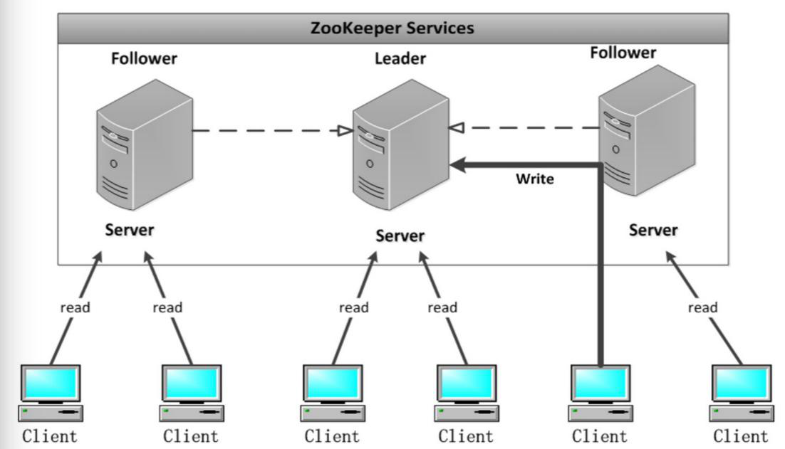

## 一 ZooKeeper简介

#### 1.1 ZooKeeper是什么

Zookeeper 是一个分布式协调服务的开源框架。   

主要用来解决分布式集群中应用系统的一致性问题，例如怎样避免同时操作同一数据造成脏读的问题。  

ZooKeeper 本质上是一个分布式的小文件存储系统，提供基于类似于文件系统的目录树方式的数据存储，并且可以对树中的节点进行有效管理。从而用来维护和监控你存储的数据的状态变化。通过监控这些数据状态的变化，从而可以达到基于数据的集群管理。 诸如： 统一命名服务(dubbo)、分布式配置管理(solr的配置集中管理)、分布式消息队列（sub/pub）、分布式锁、分布式协调等功能。  

#### 1.2 ZooKepper架构

  

Leader:
- Zookeeper集群工作的核心
- 事务请求（写操作） 的唯一调度和处理者，保证集群事务处理的顺序性
- 集群内部各个服务器的调度者

对于 create， setData， delete 等有写操作的请求，则需要统一转发给leader 处理,leader 需要决定编号、执行操作，这个过程称为一个事务。


Follower:
- 处理客户端非事务（读操作） 请求，
- 转发事务请求给 Leader；
- 参与集群 Leader 选举投票 2n-1台可以做集群投票。
- 此外，针对访问量比较大的 zookeeper 集群， 还可新增观察者角色。

Observer:
- 观察者角色，观察 Zookeeper 集群的最新状态变化并将这些状态同步过来，其对于非事务请求可以进行独立处理，对于事务请求，则会转发给 Leader服务器进行处理
- 不会参与任何形式的投票只提供非事务服务，通常用于在不影响集群事务
- 处理能力的前提下提升集群的非事务处理能力。
- 其实就是增加并发的读请求

#### 1.3 ZooKeeper的特性

- 全局数据一致：重要特征。每个server保存一份相同的数据副本，client无论连接到哪个server，展示的数据都是一致的
- 可靠性：如果消息被其中一台服务器接受，那么将被所有的服务器接受。
- 顺序性：包括全局有序和偏序两种：全局有序是指如果在一台服务器上消息 a 在消息 b 前发布，则在所有 Server 上消息 a 都将在消息 b 前被发布；偏序是指如果一个消息 b 在消息 a 后被同一个发送者发布， a 必将排在 b 前面。
- 数据更新原子性：一次数据更新要么成功（半数以上节点成功），要么失败，不存在中间状态；
- 实时性： Zookeeper 保证客户端将在一个时间间隔范围内获得服务器的更新信息，或者服务器失效的信息。

## 二 ZooKeeper集群环境

#### 2.0 集群环境安装的大致过程

Zookeeper 集群搭建指的是 ZooKeeper 分布式模式安装。 通常由 2n+1台 servers 组成。   

对于安装leader+follower 模式的集群， 大致过程如下：
- 配置主机名称到 IP 地址映射配置
- 修改 ZooKeeper 配置文件
- 远程复制分发安装文件
- 设置 myid
- 启动 ZooKeeper 集群

如果要想使用 Observer 模式，可在对应节点的配置文件添加如下配置：
```
peerType=observer
```

其次，必须在配置文件指定哪些节点被指定为 Observer，如：
```
server.1:localhost:2181:3181:observer

服务器IP	    主机名	myid的值
192.168.120.111	node01	1
192.168.120.112	node02	2
192.168.120.113	node03	3
```

#### 2.1 ZooKeeper集群安装

软件下载地址：http://archive.apache.org/dist/zookeeper/  

推荐版本：3.4.9，安装地址为：/usr/local/zookeeper/zookeeper-3.4.9

```
# 我们可以只安装node01，安装完毕后分发到node02，node03
mkdir -p /usr/local/zookeeper/
mkdir -p /usr/local/zookeeper/zkdatas/
tar -zxvf zookeeper-3.4.9.tar.gz -C /usr/local/zookeeper/
cd /usr/local/zookeeper/zookeeper-3.4.9/conf/
cp zoo_sample.cfg zoo.cfg

vim  zoo.cfg

# 修改数据文件存放地址
dataDir=/usr/local/zookeeper/zkdatas/
# 打开下列配置
autopurge.snapRetainCount=3
autopurge.purgeInterval=1
# 添加下列配置
server.1=node01:2888:3888
server.2=node02:2888:3888
server.3=node03:2888:3888

# 添加myid配置
vim /usr/local/zookeeper/zkdatas/myid   # 写入1即可

```

配置完毕后，将软件发送给node02，node03
```
cd /usr/local/
scp -r zookeeper/ node02:$PWD
scp -r zookeeper/ node03:$PWD

# 发送完毕后不要忘了分别修改node02和node03的myid配置为2，3，并清空该文件夹下其他文本
```

启动并测试软件：
```
cd /usr/local/zookeeper/zookeeper-3.4.9/bin/
zkServer.sh start           # 启动
jps                         # 查看启动进程
zkServer.sh status          # 查看集群状态，未安装三台集群时，不要使用该命令
```